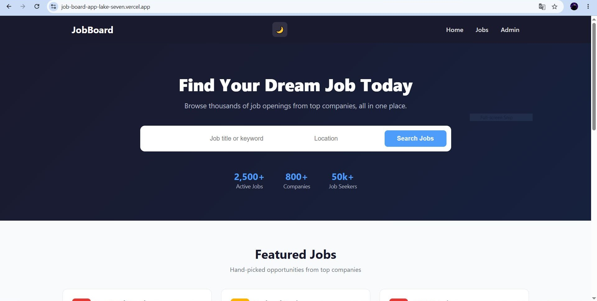
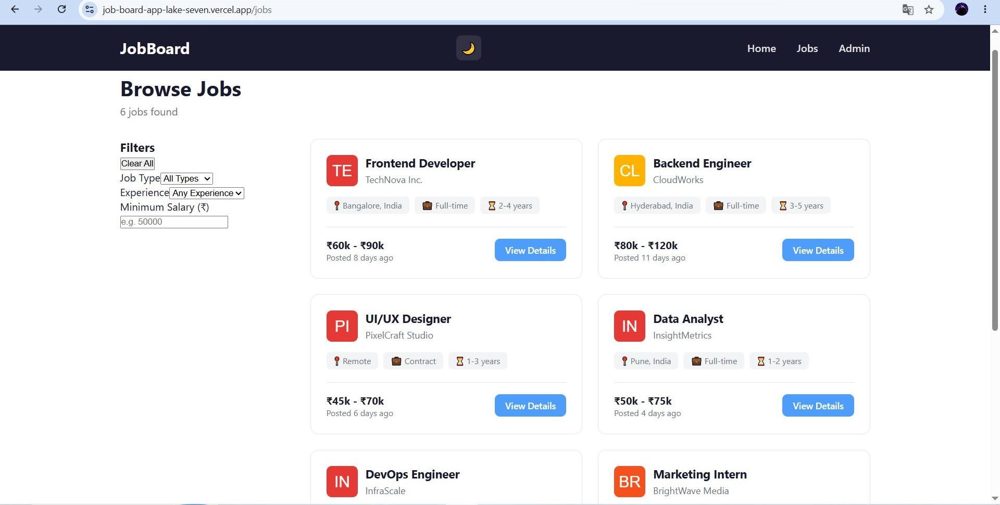
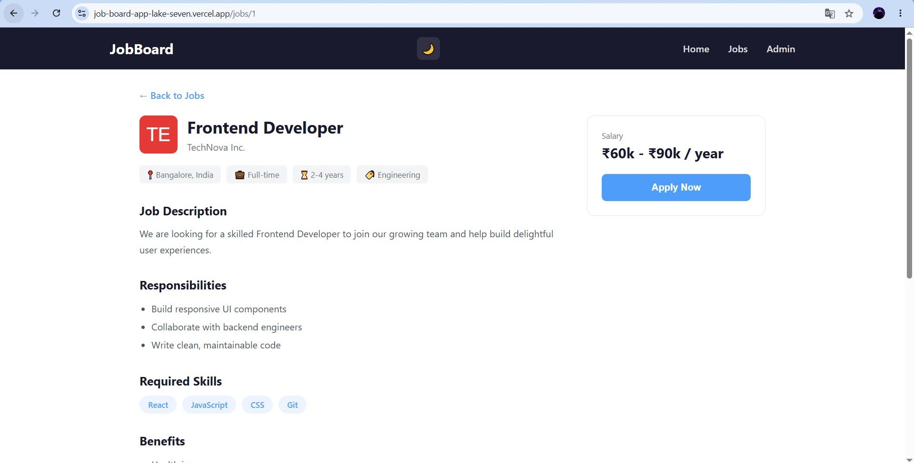
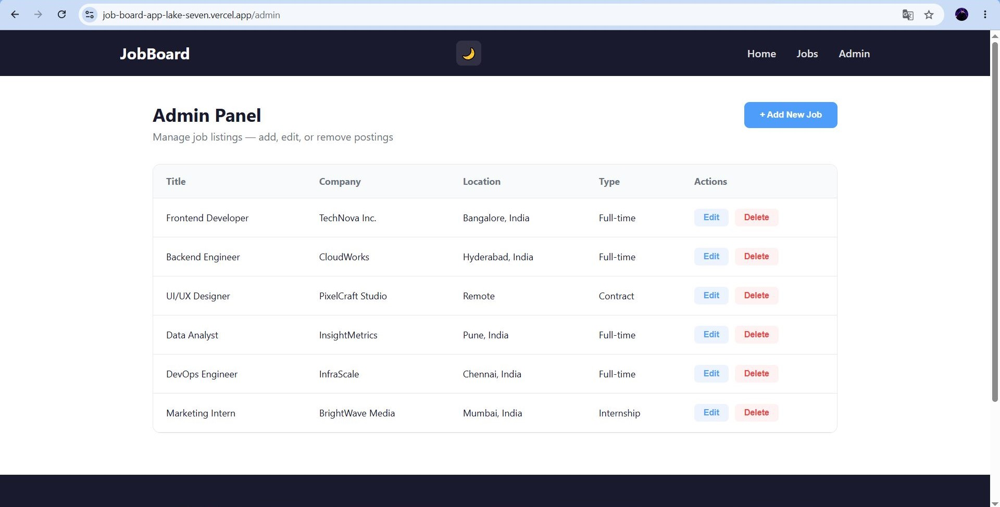

# 🧑‍💼 JobBoard — Modern Job Listing Platform


A modern, responsive Job Board web application where users can search, filter, and browse job listings, view detailed job postings, and manage listings through an admin panel — built as a full front-end project with local persistence, dark mode, and a CI/CD pipeline.

**[🔗 Live Demo](https://job-board-app-lake-seven.vercel.app/)** · **[📂 GitHub Repo](https://github.com/SHAN2348/job-board-app)**

---

## 📸 Screenshots

| Home Page | Job Listing | Job Details | Admin Panel |
|---|---|---|---|
|  |  |  |  |

> Dark mode supported across all pages.

---

## ✨ Features

**Public**
- 🔍 Search jobs by title, company, or location
- 🏷️ Filter by job type, experience level, and minimum salary
- 📂 Browse jobs by category
- ⭐ Featured jobs section on the homepage
- 📄 Detailed job pages with responsibilities, skills, benefits, and company info
- 🌗 Dark mode with persistent preference
- 📱 Fully responsive, mobile-first design
- 🔔 Toast notifications and empty/loading states

**Admin**
- ➕ Add new job listings with full form validation
- ✏️ Edit existing listings
- 🗑️ Delete listings with confirmation modal
- 💾 Data persisted via `localStorage`

**Engineering**
- ⚙️ CI pipeline via GitHub Actions (lint + build checks on every push)
- 🚀 Continuous deployment via Vercel
- ♿ Accessibility-conscious markup (labels, focus states, semantic HTML)

---

## 🛠️ Tech Stack

| Category | Technology |
|---|---|
| Framework | React 19 (Vite) |
| Routing | React Router v7 |
| Styling | CSS3 (Custom Properties for theming) |
| Data Persistence | Browser `localStorage` |
| Linting | ESLint |
| CI/CD | GitHub Actions + Vercel |
| Version Control | Git & GitHub |

---

## 📁 Folder Structure

\```
src/
├── assets/           # Static images/icons
├── components/       # Reusable UI building blocks
│   ├── Navbar/
│   ├── Footer/
│   ├── Hero/
│   ├── JobCard/
│   ├── FeaturedJobs/
│   ├── Categories/
│   ├── FilterPanel/
│   └── JobForm/
├── pages/            # Route-level page components
│   ├── HomePage/
│   ├── JobListingPage/
│   ├── JobDetailsPage/
│   ├── AdminPage/
│   └── NotFoundPage/
├── context/          # React Context providers (theme)
├── data/             # Seed job data (JSON)
├── utils/            # Data access layer (jobsService)
├── App.jsx           # Route definitions
└── main.jsx          # App entry point
\```

## 🚀 Getting Started

### Prerequisites
- [Node.js](https://nodejs.org/) v18 or higher
- npm (comes bundled with Node.js)
- Git

### Installation

1. Clone the repository
\```bash
git clone https://github.com/SHAN2348/job-board-app.git
cd job-board-app
\```

2. Install dependencies
\```bash
npm install
\```

3. Start the development server
\```bash
npm run dev
\```

4. Open [http://localhost:5173](http://localhost:5173) in your browser

### Building for Production
\```bash
npm run build
\```
Output is generated in the `dist/` folder.

### Linting
\```bash
npm run lint
\```

## ☁️ Deployment

This project is deployed on [Vercel](https://vercel.com) with continuous deployment enabled — every push to `main` automatically triggers a new production build.

A `vercel.json` rewrite rule is included to support client-side routing (React Router) correctly on page refresh for non-root routes.

## 🔮 Future Improvements

- Replace `localStorage` with a real backend (Node/Express + database) for true multi-user persistence
- Add user authentication for the Admin panel
- Implement pagination for large job listings
- Add unit and integration tests (Vitest + React Testing Library)
- Add a "Save Job" / favorites feature for job seekers
- Company profile pages with all jobs from that company

---

## 📄 License

This project is licensed under the MIT License — see the [LICENSE](./LICENSE) file for details.